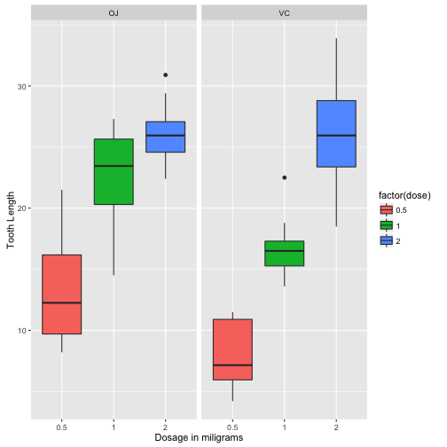

## Analyze the ToothGrowth data in the R datasets package.

```r
# load the dataset
library(datasets)
library(ggplot2)

data(ToothGrowth)
str(ToothGrowth)
```

```
## 'data.frame':	60 obs. of  3 variables:
##  $ len : num  4.2 11.5 7.3 5.8 6.4 10 11.2 11.2 5.2 7 ...
##  $ supp: Factor w/ 2 levels "OJ","VC": 2 2 2 2 2 2 2 2 2 2 ...
##  $ dose: num  0.5 0.5 0.5 0.5 0.5 0.5 0.5 0.5 0.5 0.5 ...
```

---

## Summary of the data

```r
ToothGrowth$dose <- as.factor(ToothGrowth$dose)
summary(ToothGrowth)
```

```
##       len        supp     dose   
##  Min.   : 4.20   OJ:30   0.5:20  
##  1st Qu.:13.07   VC:30   1  :20  
##  Median :19.25           2  :20  
##  Mean   :18.81                   
##  3rd Qu.:25.27                   
##  Max.   :33.90
```

---

## Clear positive corr between tooth & dose 

```r
g1 <- ggplot(ToothGrowth, aes(x=factor(dose),y=len,fill=factor(dose)))
```


---

##  Confidence intervals and/or hypothesis tests 

```r
fit <- lm(len ~ dose + supp, data=ToothGrowth)
confint(fit)
```

```
##                 2.5 %    97.5 %
## (Intercept) 10.475238 14.434762
## dose1        6.705297 11.554703
## dose2       13.070297 17.919703
## suppVC      -5.679762 -1.720238
```

